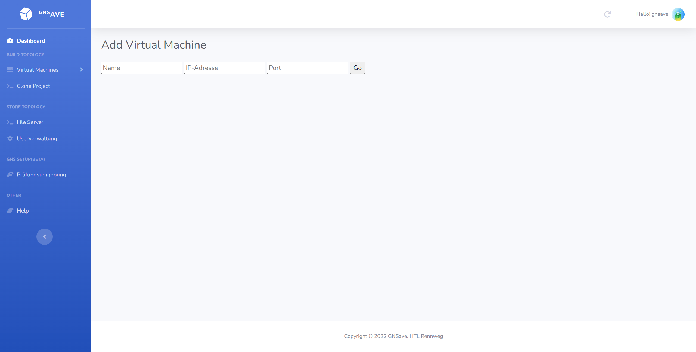

Build Topology
=====

.. _overview:

Überblick
----------------

Das Build Topology System bietet die Möglichkeit GNS3 Projekte von Virtuelle Hosts zu sehen, hinzuzufügen und zu löschen. Außerdem kann man Projekte von einem virtuellen Host zu einem oder mehreren anderen kopieren. Das kopieren oder auch "clonen" wird angeboten um Lehrern einen bequemen Weg zu bieten begonnene, falsche oder auch fertige Topologien an Schüler zu senden, damit diese nicht von "null" starten müssen. So können Schüler an einer vorgegebenen Topologie weiterarbeiten, eine fertige weiterverwenden oder falsche "troubleshooten" und richtigstellen.

Überblick der Features
--------------------------------
Bei Start unseres Tools landet mal zu allererst auf der Dashboard Page. Hier werden abgesehen von allen virtuellen Hosts mit denen eine Verbindung besteht auch ein Button um einen virtuellen Hosts hinzuzufügen (eine Verbindung mit diesem aufbauen) angezeigt.

.. image:: images/dashboard-page.PNG
  :width: 600
  :alt: Dashboard Page

Virtual Host Ansicht
^^^^^^^^^^^^^^^^^^^^^^^^^^
Hier kann man nun auf eine der Boxen, welche einen virtuellen Host repräsentieren, klicken und kommt dann auf eine Page mit der man eine detailreichere Ansicht eines virtuellen Hosts sieht. Man sieht alle GNS3 Projekte, welche sich auf der virtuellen Maschine befinden, in einer vertikalen Reihe. Darunter befinden sich zwei Buttons, einmal einer der den User wieder zu der Dashboard Page bringt und einmal einen Button um ein GNS3 Projekt auf dem virtuellen Host hinzuzufügen.

.. image:: images/virtuel-host-detail.PNG
  :width: 600
  :alt: Virtual Host Page
  
Add Virtual Host Ansicht
^^^^^^^^^^^^^^^^^^^^^^^^^^
Zurück bei der Dashboard Page kann man alternativ auch auf den "Add VM" Button klicken und kommt somit zu dieser Ansicht bei der man die IP-Addresse der virtuellen Machine, den Port und ... angeben muss. Läuft alles nach Plan wird auf der Dashboard Page nun eine zusätzliche VM angezeigt.

  
Aufbau
----------------

Hier sieht man den Aufbau der Build-Topology Funktionen:

.. image:: images/gns3-api-class-diagram.svg
  :width: 600
  :alt: GNS3-API Klassendiagramm
   
Verwendete Funktionen (views.py)
--------------------

Im folgenden werden die verwendeten Funktionen der views.py Datei erklärt:

Pfad: ``namespaces/build-topology/views.py``

virtualmachines
^^^^^^^^^^^^^^^^

Rendert die Dashboard Page bzw. die Startseite bei der man alle VM's mit einer Verbindung sieht.

.. code-block:: python

  @login_required()
  def virtualmachines(request):
      if not request.user.is_superuser:
          return render(request, "user/404.html")
      return render(request, "admin/Build Topology/Virtual Machines/virtual_machines.html")

projects
^^^^^^^^^^^^^^^^

Rendert die Projekt Page bzw. die Seite bei der man alle GNS3 Projekte, welche auf einer VM gespeichert sind, sieht.

.. code-block:: python

  @login_required()
  def projects(request, vm=None):
      if not request.user.is_superuser:
          return render(request, "user/404.html")

      if not vm:
          vm = request.GET.get('vm', '')

      if vm not in virtual_machines:
          return render(request, "admin/404.html")

      virtual_machine = virtual_machines[vm]

      return render(request, "admin/Build Topology/Projects/projects.html", 
                    context={"projects": virtual_machine.get_projects(), "virtual_machine": vm})

reload
^^^^^^^^^^^^^^^^

Wird für einen reload der Page benutzt bzw. man wird wieder auf die derzeitige Page gebracht.

.. code-block:: python

  @login_required()
  def reload(request):
      if not request.user.is_superuser:
          return render(request, "user/404.html")
      for vm in virtual_machines.values():
          vm.init_projects()
      return redirect("/")

devices
^^^^^^^^^^^^^^^^

Rendert die Devices Page bzw. die Seite bei der man die Devices, welche sich in einem GNS3 Projekt befinden, sieht.

.. code-block:: python

  @login_required()
  def devices(request, vm, project):
      if not request.user.is_superuser:
          return render(request, "user/404.html")

      if not vm:
          vm = request.GET.get('vm', '')

      if not project:
          project = request.GET.get('projects', '')

      if vm not in virtual_machines:
          return render(request, "admin/404.html")

      projekte = virtual_machines[vm].get_projects()

      if project not in projekte:
          return render(request, "admin/404.html")

      projekt = projekte[project]

      return render(request, "admin/Build Topology/Devices/devices.html",
                    context={"devices": projekt.get_devices().items(), "project": project, "virtual_machine": vm})

config
^^^^^^^^^^^^^^^^

Rendert die Config Page bzw. die Seite bei der man die Devices, welche sich in einem GNS3 Projekt befinden, aussuchen kann um diese mit einer bestimmten Konfiguration zu konfigurieren.

.. code-block:: python

  @login_required()
  def config(request, vm, project):
      if not request.user.is_superuser:
          return render(request, "user/404.html")
      if not vm:
          vm = request.GET.get('vm', '')

      if vm not in virtual_machines:
          return render(request, "admin/404.html")

      projekte = virtual_machines[vm].get_projects()
      if project not in projekte:
          return render(request, "admin/404.html")

      return render(request, "admin/Build Topology/Devices/conf_devices.html",
                    context={"devices": projekte[project].get_devices(), "project": project, "virtual_machine": vm})

push_config_to_devices
^^^^^^^^^^^^^^^^^^^^^^^^

Rendert die Config Page bzw. die Seite bei der man die Devices, welche sich in einem GNS3 Projekt befinden, aussuchen kann um diese mit einer bestimmten Konfiguration zu konfigurieren. Hierbei wird die Konfiguration nun wirklich auf die ausgewählten Devices mittels Threads gepushed/gesendet.

.. code-block:: python

  @login_required()
  def push_config_to_devices(request, vm, project):
      if not request.user.is_superuser:
          return render(request, "user/404.html")

      if not vm:
          vm = request.GET.get('vm', '')

      if vm not in virtual_machines:
          return render(request, "admin/404.html")

      projekte = virtual_machines[vm].get_projects()
      if project not in projekte:
          return render(request, "admin/404.html")

      projekt = projekte[project]
      devices = projekt.get_devices()

      geraete = [device for device in devices if request.POST.get(device, "")]
      timesleep = request.POST.get("timesleep", "")
      config = request.POST.get("config", "")
      
      for geraet in geraete:
        thread = threading.Thread(target=projekt.write_config, args=(geraet, config, timesleep))
        thread.start()

      return render(request, "admin/Build Topology/Devices/conf_devices.html",
                    context={"devices": projekt.get_devices(), "project": project, "virtual_machine": vm})

choose_vm_to_clone_from
^^^^^^^^^^^^^^^^^^^^^^^^

Rendert die "Choose VM to clone from" Page bzw. die Seite bei der man sich die VM aussuchen kann, von welcher man im folgenden ein GNS3 Projekt zum clonen/kopieren benutzt.

.. code-block:: python

  @login_required()
  def choose_vm_to_clone_from(request):
      if not request.user.is_superuser:
          return render(request, "user/404.html")

      return render(request, "admin/Build Topology/Clone Project/choose_vm_to_clone_from.html")

choose_project_to_clone
^^^^^^^^^^^^^^^^^^^^^^^^

Rendert die "Choose Project to clone" Page bzw. die Seite bei der man sich das GNS3 Projekt aussuchen kann, welches man im Folgenden zu einer anderen oder mehreren VMs cloned/kopiert.

.. code-block:: python

  @login_required()
  def choose_project_to_clone(request, vm):
      if not request.user.is_superuser:
          return render(request, "user/404.html")
      if not vm:
          vm = request.GET.get('vm', '')

      if vm not in virtual_machines:
          return render(request, "admin/404.html")

      return render(request, "admin/Build Topology/Clone Project/choose_project_to_clone.html",
                    context={"projects": virtual_machines[vm].get_projects(), "virtual_machine": vm})

select_what_vms_to_clone_to
^^^^^^^^^^^^^^^^^^^^^^^^^^^^^^

Rendert die "Select VM(s) to clone to" Page bzw. die Seite bei der man sich die VM(s) aussuchen kann, zu denen man im Folgenden ein GNS3 Projekt cloned/kopiert.

.. code-block:: python

  @login_required()
  def select_what_vms_to_clone_to(request, vm):
      if not request.user.is_superuser:
          return render(request, "user/404.html")
      if not vm:
          vm = request.GET.get('vm', '')

      if vm not in virtual_machines:
          return render(request, "admin/404.html")

      projekte = virtual_machines[vm].get_projects()

      project = request.POST.get("projekt", "")
      if project not in projekte:
          return render(request, "admin/404.html")

      return render(request, "admin/Build Topology/Clone Project/select_vms.html",
                    context={"project": project, "virtual_machine": vm})

clone_project
^^^^^^^^^^^^^^^^^^^^^^^^

Cloned/Kopiert nun das ausgewählte GNS3 Projekt von der ausgewählten VM zu den ausgewählten VM(s).

.. code-block:: python

  @login_required()
  def clone_project(request, vm, project):
      if not request.user.is_superuser:
          return render(request, "user/404.html")
      if not vm:
          vm = request.GET.get('vm', '')

      if vm not in virtual_machines:
          return render(request, "admin/404.html")

      projekte = virtual_machines[vm].get_projects()
      if project not in projekte:
          return render(request, "admin/404.html")

      vms = [virtual_machine for vm, virtual_machine in virtual_machines.items() if request.POST.get(vm, "")]
      vm = virtual_machines[vm]
      vm.clone_project(project, vms)

      return redirect("/build_topology/relaod")

add_vm
^^^^^^^^^^^^^^^^^^^^^^^^

Rendert die "Add VM" Page und holt sich den Namen, die IP-Addresse sowie die Portnummer um diese VM dann hinzuzufügen.

.. code-block:: python

  @login_required()
  def add_vm(request):
      if not request.user.is_superuser:
          return render(request, "user/404.html")
      if request.method == "GET":
          return render(request, "admin/Build Topology/Virtual Machines/add_vm.html")
      name = request.POST.get("name", "")
      ip = request.POST.get("ip", "")
      port = request.POST.get("port", "")
      with open('assets/gns3_api_calls/virtual_machines', 'a') as file:
          file.write(f"\n{name},{ip},{port}")
      try:
          get_virtual_machines("assets/gns3_api_calls/virtual_machines")
      except:
          return render(request, "admin/404.html")
      return redirect("/")

add_project
^^^^^^^^^^^^^^^^^^^^^^^^

Rendert die "Add Project" Page und holt sich den Namen um dieses GNS3 Projekt dann hinzuzufügen.

.. code-block:: python

  @login_required()
  def add_project(request, vm):
      if not request.user.is_superuser:
          return render(request, "user/404.html")
      if request.method == "GET":
          return render(request, "admin/Build Topology/Projects/add_project.html", context={"vm": vm})
      if not vm:
          vm = request.GET.get('vm', '')

      if vm not in virtual_machines:
          return render(request, "admin/404.html")

      name = request.POST.get("name", "")
      virtual_machines[vm].create_project(name)
      return redirect(f"/build_topology/projects/{vm}")

add_device
^^^^^^^^^^^^^^^^^^^^^^^^

Rendert die "Add Device" Page und holt sich den Namen sowie den Node-Type um dieses Device dann hinzuzufügen.

.. code-block:: python

  @login_required()
  def add_device(request, vm, project):
      if not request.user.is_superuser:
          return render(request, "user/404.html")
      if request.method == "GET":
          return render(request, "admin/Build Topology/Devices/create_device.html",
                        context={"project": project, "virtual_machine": vm})

      name = request.POST.get("name", "")
      node_type = request.POST.get("node_type", "")

      if not vm:
          vm = request.GET.get('vm', '')

      if vm not in virtual_machines:
          return render(request, "admin/404.html")

      projekte = virtual_machines[vm].get_projects()
      if project not in projekte:
          return render(request, "admin/404.html")

      projekt = projekte[project]

      projekt.create_device(name, node_type)
      return render(request, "admin/Build Topology/Devices/devices.html",
                    context={"devices": projekt.get_devices().items(), "project": project, "virtual_machine": vm})

edit
^^^^^^^^^^^^^^^^^^^^^^^^

Rendert die "Edit Device" Page und bietet eine Möglichkeit das Device zu starten, zu stoppen und den Namen zu ändern.

.. code-block:: python

  def edit(request, vm, project, device):
      if not request.user.is_superuser:
          return render(request, "user/404.html")
      if request.method == "GET":
          return render(request, "admin/Build Topology/Devices/edit.html",
                        context={"device": device, "project": project, "virtual_machine": vm})

      if not vm:
          vm = request.GET.get('vm', '')

      if vm not in virtual_machines:
          return render(request, "admin/404.html")

      projekte = virtual_machines[vm].get_projects()
      if project not in projekte:
          return render(request, "admin/404.html")

      projekt = projekte[project]
      if 'start' in request.POST:
          projekt.start_device(device)
      elif 'stop' in request.POST:
          projekt.stop_device(device)
      else:
          return render(request, "admin/404.html")

      return redirect(f"/build_topology/devices/{vm}/{project}")

Verwendete Funktionen (virtual_machine.py)
----------------------------------

Im folgenden werden die verwendeten Funktionen der VirtualMachine Klasse erklärt:

Pfad: ``assets/gns3_api_calls/virtual_machine.py``

VirtualMachine Class
^^^^^^^^^^^^^^^^^^^^^^

Realisiert eine Klasse, welche eine virtuelle Machine repräsentiert. Die ``__init__`` Funktion initialisiert die Klasse und die ``__str__`` Funktion repräsentiert die Klasse als String.

.. code-block:: python

  class VirtualMachine:
    def __init__(self, name, ip, port):
        self.name = name
        self.ip = ip
        self.port = port
        self.vm_ip = self.get_vm_ip()
        self.vm_port = self.get_vm_port()
        self.projects = {}
        self.init_projects()
        self.status = self.get_status()

    def __str__(self):
        return f"(Virtual Machine) - Name: {self.name}, IP: {self.ip}, Port: {self.port}, Projects: {len(self.projects)}"
        
init_projects
^^^^^^^^^^^^^^^^^^^^^^

Initialisiert alle GNS3 Projekte einer VM.

.. code-block:: python

    def init_projects(self):
        projects = requests.get(url=f"http://{self.ip}:{self.port}/v2/projects")
        for project in projects.json():
            if project not in projects:
                self.projects[project["name"]] = Project(ip=self.ip,
                                                         vm_ip=self.vm_ip,
                                                         port=self.port,
                                                         name=project["name"],
                                                         project_id=project["project_id"]
                                                         )

create_project
^^^^^^^^^^^^^^^^^^^^^^

Erzeugt ein Projekt mittels Konstruktor.

.. code-block:: python

    def create_project(self, name):
        self.projects[name] = Project(ip=self.ip, vm_ip=self.vm_ip,
                                      port=self.port,
                                      name=name
                                      )
        self.projects[name].add_compute()

get_vm_ip
^^^^^^^^^^^^^^^^^^^^^^

Returned die IP-Addresse einer virtuellen Machine.

.. code-block:: python

    def get_vm_ip(self):
        request = requests.get(f"http://{self.ip}:{self.port}/v2/computes/vm")
        vm_ip = request.json()["host"]
        if request.status_code == 404:
            vm_ip = self.ip
        return vm_ip

get_vm_port
^^^^^^^^^^^^^^^^^^^^^^

Returned die Portnummer einer virtuellen Machine.

.. code-block:: python

    def get_vm_port(self):
        request = requests.get(f"http://{self.ip}:{self.port}/v2/computes/vm")
        vm_port = request.json()["port"]
        if request.status_code == 404:
            vm_port = self.port
        return vm_port

get_status
^^^^^^^^^^^^^^^^^^^^^^

Returned den Status ob die VM auf einem Host läuft oder nicht.

.. code-block:: python

    def get_status(self):
        return requests.get(f"http://{self.ip}:{self.port}/v2/version").status_code == 200

get_projects
^^^^^^^^^^^^^^^^^^^^^^

Returned alle Projekte der VM.

.. code-block:: python

    def get_projects(self):
        return self.projects

download_project_from_vm
^^^^^^^^^^^^^^^^^^^^^^^^^^

Lädt ein Projekt von einer VM herunter.

.. code-block:: python

    def download_project_from_vm(self, name, filepath):
        a = requests.get(f"http://{self.ip}:{self.port}/v2/projects/{self.projects[name].get_project_id()}/export")
        with open(f"{filepath}/{name}.gns3project", 'wb') as file:
            file.write(a.content)

upload_project_to_vm
^^^^^^^^^^^^^^^^^^^^^^^^^^

Lädt ein Projekt auf eine VM.

.. code-block:: python

    def upload_project_to_vm(self, filepath):
        project_id = f"{secrets.token_hex(4)}-{secrets.token_hex(2)}-{secrets.token_hex(2)}-{secrets.token_hex(2)}-{secrets.token_hex(6)}"
        with open(filepath, 'rb') as file:
            data = file.read()
        requests.post(f"http://{self.ip}:{self.port}/v2/projects/{project_id}/import", data=data)

clone_project
^^^^^^^^^^^^^^^^^^^^^^^^^^

Cloned/Kopiert ein Projekt von einer VM zu mehreren VMs oder einer VM.

.. code-block:: python

    def clone_project(self, project_name, vm_list):
        data = requests.get(
            f"http://{self.ip}:{self.port}/v2/projects/{self.projects[project_name].get_project_id()}/export")
        for vm in vm_list:
            project_id = f"{secrets.token_hex(4)}-{secrets.token_hex(2)}-{secrets.token_hex(2)}-{secrets.token_hex(2)}-{secrets.token_hex(6)}"
            requests.post(f"http://{vm.ip}:{vm.port}/v2/projects/{project_id}/import", data=data)

Verwendete Funktionen (project.py)
----------------------------------

Im folgenden werden die verwendeten Funktionen der Project Klasse erklärt:

Pfad: ``assets/gns3_api_calls/project.py``

Project Class
^^^^^^^^^^^^^^^^^^^^^^

Realisiert eine Klasse, welche ein GNS3 Projekt repräsentiert. Die ``__init__`` Funktion initialisiert die Klasse und die ``__str__`` Funktion repräsentiert die Klasse als String.

.. code-block:: python

  class Project:
      def __init__(self, ip, vm_ip, port, name, project_id=None):
          self.devices = {}
          self.ip = ip
          self.vm_ip = vm_ip
          self.port = port
          self.name = name

          if not project_id:
              self.create_project()
          else:
              self.project_id = project_id
              self.init_devices()
          self.add_compute()
      
      def __str__(self):
          return f"(Project) - Name: {self.name}, Devices: {len(self.devices)}, Project_id: {self.project_id}"

create_project
^^^^^^^^^^^^^^^^^^^^^^

Erzeugt ein GNS3 Projekt auf dem Host.

.. code-block:: python

      def create_project(self):
          project = requests.post(f"http://{self.ip}:{self.port}/v2/projects", json={"name": self.name})
          if project.status_code == 201:
              self.project_id = project.json()["project_id"]
          else:
              self.project_id = None

init_devices
^^^^^^^^^^^^^^^^^^^^^^

Initialisiert alle Devices in einem GNS3 Projekt.

.. code-block:: python

      def init_devices(self):
          devices = requests.get(f"http://{self.ip}:{self.port}/v2/projects/{self.project_id}/nodes")
          for device in devices.json():
              hda_disk_image = None
              telnet_port = device['console']
              node_id = device['node_id']
              node_type = device['node_type']

              if "hda_disk_image" in device["properties"]:
                  hda_disk_image = device["properties"]["hda_disk_image"]

              self.devices[device['name']] = Device(
                  name=device['name'],
                  ip=self.ip,
                  vm_ip=self.vm_ip,
                  port=self.port,
                  project_id=self.project_id,
                  node_type=node_type,
                  values={"node_id": node_id,
                          "telnet_port": telnet_port,
                          "hda_disk_image": hda_disk_image
                          }
              )
          return True

create_device
^^^^^^^^^^^^^^^^^^^^^^

Erstellt ein Device in einem GNS3 Projekt.

.. code-block:: python

      def create_device(self, name, node_type):
          self.open()
          self.devices[name] = Device(name=name,
                                      ip=self.ip,
                                      vm_ip=self.vm_ip,
                                      port=self.port,
                                      project_id=self.project_id,
                                      node_type=node_type,
                                      )

link_device
^^^^^^^^^^^^^^^^^^^^^^

Linked/Verbindet zwei Devices in einem GNS3 Projek über ausgewählte Adapter miteinander.

.. code-block:: python

      def link_devices(self, node1, node2, adapter1, adapter2):
          self.open()
          response = requests.post(f"http://{self.ip}:{self.port}/v2/projects/{self.project_id}/links", json={
              "nodes": [
                  {
                      "adapter_number": adapter1,
                      "node_id": self.devices[node1].node_id,
                      "port_number": 0
                  },
                  {
                      "adapter_number": adapter2,
                      "node_id": self.devices[node2].node_id,
                      "port_number": 0
                  }
              ]
          })
          if not response.status_code == 201:
              print(response.json())

add_compute
^^^^^^^^^^^^^^^^^^^^^^

TODO

.. code-block:: python

      def add_compute(self):
          requests.post(f"http://{self.ip}:{self.port}/v2/compute/projects", json={
              "name": self.name,
              "project_id": self.project_id,
              "variables": None
          })

write_config
^^^^^^^^^^^^^^^^^^^^^^

Konfiguriert ein Device in einem GNS3 Projekt.

.. code-block:: python

      def write_config(self, name, config, timeout=240):
          self.devices[name].write_config(config, timeout)

start_device
^^^^^^^^^^^^^^^^^^^^^^

Startet ein Device in einem GNS3 Projekt.

.. code-block:: python

      def start_device(self, name):
          self.devices[name].start_device()

stop_device
^^^^^^^^^^^^^^^^^^^^^^

Stoppt ein Device in einem GNS3 Projekt.

.. code-block:: python

      def stop_device(self, name):
          self.devices[name].stop_device()

open
^^^^^^^^^^^^^^^^^^^^^^

Öffnet ein GNS3 Projekt, sodass diverse schon erwähnte Feature & Funktionen ausgeführt werden können.

.. code-block:: python

      def open(self):
          requests.post(f"http://{self.ip}:{self.port}/v2/projects/{self.project_id}/open")

close
^^^^^^^^^^^^^^^^^^^^^^

Schließt ein GNS3 Projekt.

.. code-block:: python

      def close(self):
          requests.post(f"http://{self.ip}:{self.port}/v2/projects/{self.project_id}/close")

get_devices
^^^^^^^^^^^^^^^^^^^^^^

Returned alle Devices in einem GNS3 Projekt.

.. code-block:: python

      def get_devices(self):
          return self.devices

get_project
^^^^^^^^^^^^^^^^^^^^^^

Returned die ID eines GNS3 Projektes.

.. code-block:: python

      def get_project_id(self):
          return self.project_id

Verwendete Funktionen (device.py)
----------------------------------

Im folgenden werden die verwendeten Funktionen der Device Klasse erklärt:

Pfad: ``assets/gns3_api_calls/device.py``

Device Class
^^^^^^^^^^^^^^^^^^^^^^

Realisiert eine Klasse, welche ein Device in einem GNS3 Projekt repräsentiert. Die ``__init__`` Funktion initialisiert die Klasse und die ``__str__`` Funktion repräsentiert die Klasse als String.

.. code-block:: python

  class Device:
      def __init__(self, name, node_type, ip, vm_ip, port, project_id, values=None):
          self.name = name
          self.ip = ip
          self.vm_ip = vm_ip
          self.port = port
          self.project_id = project_id
          if not values:
              self.node_type = get_node_type(node_type)
              self.create_device(node_type)
          else:
              self.node_type = get_node_type(node_type, values["hda_disk_image"])
              self.node_id = values["node_id"]
              self.telnet_port = values["telnet_port"]
  
      def __str__(self):
          return f"(Device) - Name: {self.name}, Telnet Port: {self.telnet_port}, NodeType: {self.node_type['node_type']}"

start_device
^^^^^^^^^^^^^^^^^^^^^^

Startet ein Device in einem GNS3 Projekt.

.. code-block:: python

      def start_device(self):
          return requests.post(
              url=f"http://{self.ip}:{self.port}/v2/projects/{self.project_id}/nodes/{self.node_id}/start").status_code == 200

stop_device
^^^^^^^^^^^^^^^^^^^^^^

Stoppt ein Device in einem GNS3 Projekt.

.. code-block:: python

      def stop_device(self):
          return requests.post(
              url=f"http://{self.ip}:{self.port}/v2/projects/{self.project_id}/nodes/{self.node_id}/stop").status_code == 200

create_device
^^^^^^^^^^^^^^^^^^^^^^

Erzeugt ein Device in einem GNS3 Projekt.

.. code-block:: python

      def create_device(self, nt):
          if nt.startswith("qemu"):
              self.create_device_qemu()
          else:
              create_node = requests.post(url=f"http://{self.ip}:{self.port}/v2/projects/{self.project_id}/nodes",
                                          json={"compute_id": "vm",
                                                "name": self.name,
                                                "node_type": self.node_type["node_type"],
                                                "symbol": self.node_type["symbol"],
                                                "port_name_format": "Gi{1}/{0}",
                                                "port_segment_size": 4,
                                                })
              if create_node.status_code == 201:
                  self.node_id = create_node.json()['node_id']
                  self.telnet_port = create_node.json()['console']
              else:
                  print(create_node.json())

create_device_quemu
^^^^^^^^^^^^^^^^^^^^^^

Erzeugt ein "qemu" Device in einem GNS3 Projekt. Zu "qemu" Devices gehören alle Devices, welches keine Standard GNS3 Devices sind (welche von Haus aus dabei sind), sondern alle welche ein spezifisches OS benutzen. Z.B.: ein Cisco Catalyst 2960 Series Switches. 

.. code-block:: python

      def create_device_qemu(self):
          create_node = requests.post(
              url=f"http://{self.ip}:{self.port}/v2/projects/{self.project_id}/nodes",
              json={"node_type": "qemu",
                    "compute_id": "vm",
                    "symbol": self.node_type["symbol"],
                    "name": self.name,
                    "properties": {
                        "hdb_disk_image": self.node_type["hdb_disk_image"],
                        "hda_disk_image": self.node_type["hda_disk_image"],
                        "qemu_path": self.node_type["qemu_path"],
                        "ram": 768,
                        "adapters": self.node_type["adapters"]
                    },
                    "port_name_format": "Gi{1}/{0}",
                    "port_segment_size": 4,
                    }
          )
          if create_node.status_code == 201:
              self.node_id = create_node.json()['node_id']
              self.telnet_port = create_node.json()['console']
          else:
              print(create_node.json())

write_config
^^^^^^^^^^^^^^^^^^^^^^

Schreibt eine beliebige Konfiguration in ein Device.

.. code-block:: python

      def write_config(self, config, timeout=240):
          self.start_device()
          
          connection = telnetlib.Telnet(host=self.vm_ip,
                                        port=self.telnet_port)
          connection.read_until(match=b"WirdNichtPassieren", timeout=int(timeout))

          connection.write(chr(13).encode("ascii"))
          connection.read_until(match=b"WirdNichtPassieren", timeout=5)

          erg = b''
          for line in config.splitlines():
              erg += line.encode('ascii') + b'\n'

          connection.write(erg)
          connection.read_until(match=b"WirdNichtPassieren", timeout=5)
          connection.close()

