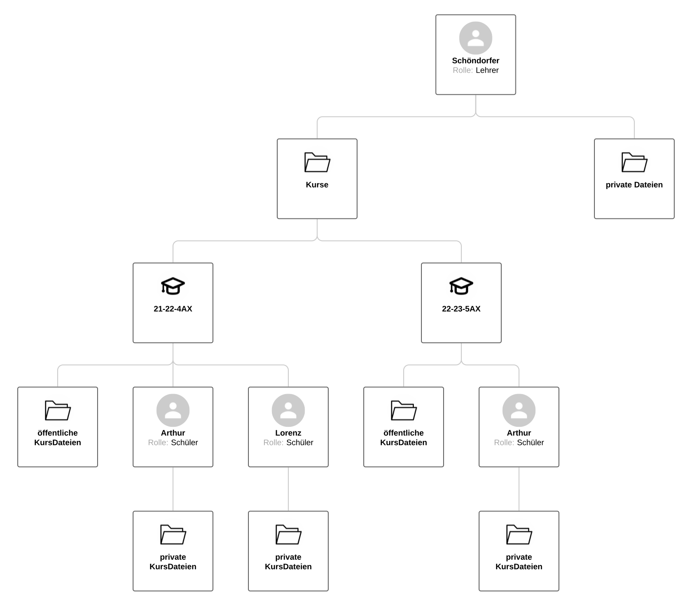
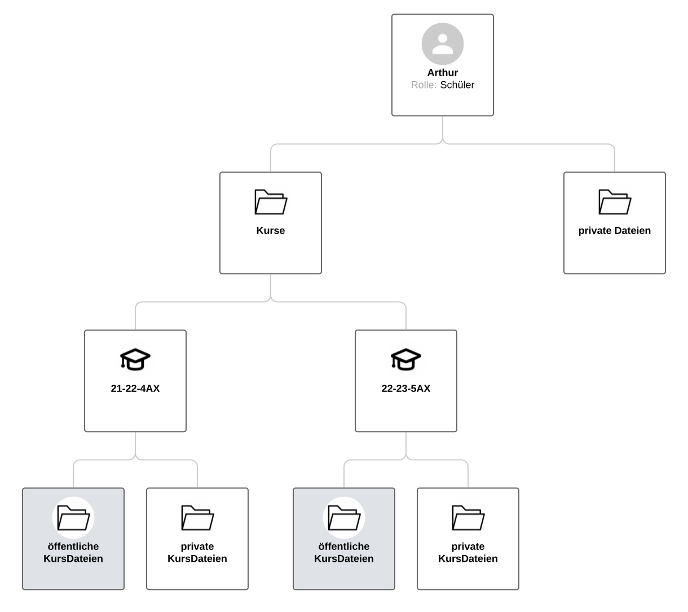
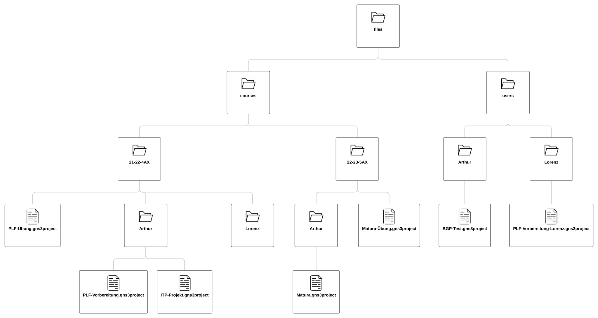

Fileserver
=====

.. _fileserver:

Überblick
------------

Der Fileserver basiert auf einem Kurs System. Die User haben jedoch keine Rechte sondern entweder die Schüler oder die Lehrer Rolle. Je nach Accounttyp sieht der User dann andere Sachen. Lehrer haben zum Beispiel Zugriff auf das Cloning Tool und Schüler nicht.

Filesystem
------------

Das Filesystem ist in private und Kurs Dateien geteilt. Auf die privaten Dateien hat nur der jeweilige User Zugriff. Auf die Kurs Dateien hat wieder jeder Schüler nur auf seine eigenen Dateien Zugriff, aber der Kursleiter/Lehrer kann jegliche Schülerdateien einsehen.

Die Dateien auf die Lehrer Zugriff hat könenn so aussehen (er hat in jedem Folder alle Rechte):

 
Im Kontrast dazu sind das zum Beispiel die Dateien die ein Schüler sieht(grau heißt er kann nichts verändern):

Aufbau
------------

Das Filesystem ist dann logisch in zwei Teile geteilt. In die User und die Course Files

.. code-block:: bash

    files
    │
    ├── users
    │   ├── lorenz
    │   │   └── project.gns3project
    │   │
    │   └── arthur
    │      └── plf_vorbereitung.gns3project
    │
    └── courses      
        ├── 21-22-4AX
        │   └── plf_uebung.gns3project
        │   └── lorenz
        │   └── arthur
        │      └── plf_uebung.gns3project
        │ 
        └── 22-23-5AX
           └── matura_uebung.gns3project
           └── arthur
              └── matura_uebung.gns3project

   
Verwendeten Funktionen
----------------

namespaces/fileserver/views.py:

add_user:
.. code-block:: python

  def add_user(username, password, email, superuser=False):
      user = get_user_model().objects.create_user(
      username=username,
      email=email,
      password=password
    )
    if superuser:
        user.is_superuser = True
        user.is_staff = True
    user.save()
    
    os.mkdir(f"./files/users/{username}")
    
add_group:
.. code-block:: python

  def add_group(name):
    Group.objects.get_or_create(name=name)
    
    os.mkdir(f"./files/courses/{name}")
    
add_user_to_group:
.. code-block:: python

  def add_user_to_group(username, groupname):
    my_group = Group.objects.get(name=groupname)
    myuser = User.objects.get(username=username)
    my_group.user_set.add(myuser)
    
    os.mkdir(f"./files/courses/{groupname}/{username}")
    
delete_user:
.. code-block:: python

  def delete_user(username):
    get_user_model().objects.get(username=username).delete()
    courses = os.listdir("./files/courses/")
    for kurs in courses:
        if os.path.exists(f"./files/courses/{kurs}/{username}"):
            shutil.rmtree(f"./files/courses/{kurs}/{username}")

    shutil.rmtree(f"./files/users/{username}")
    
 
   
Überblick der Features
----------------

To-Do

 
