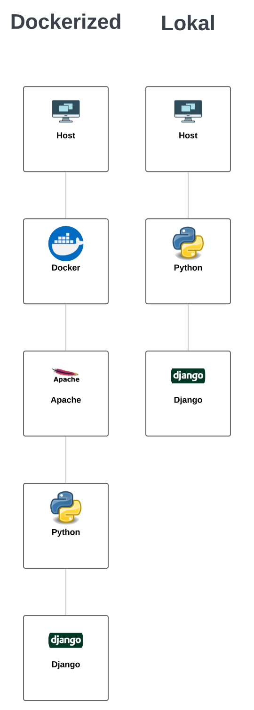
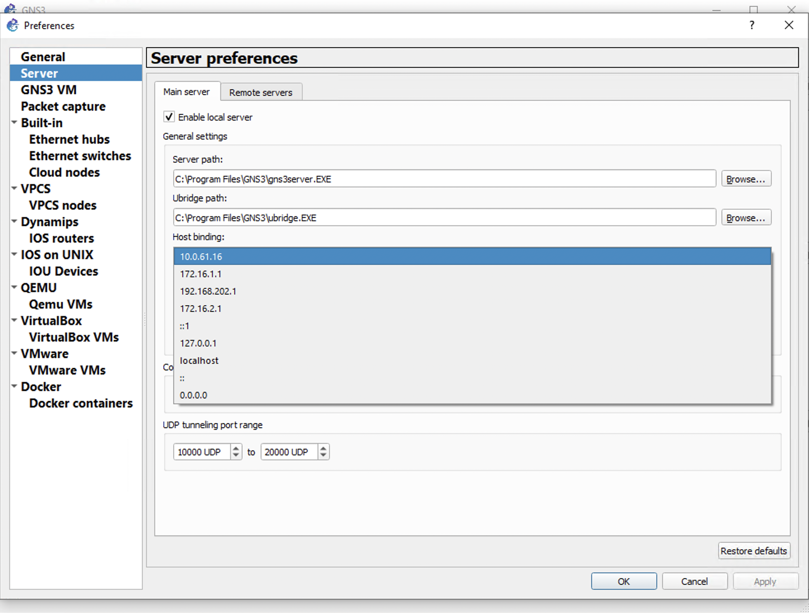

Overview
==========

.. _overview:

Die Infrastruktur
-------------------

Je nach dem welche Installationsart man gewählt hat sieht es dementsprechend anders aus

Wichtige Faktoren damit GNSave funktionert
------------------------------------------------

**GNSave muss im gleichen Netzwerk sein wie die VMs. Wenn das nicht möglich ist muss man GNSave über einen VPN
ins Netzwerk bringen**

Bei **allen** PCs auf denen GNS3 läuft muss der Lokale Server auf die globale IP gebridged werden. Das macht man so:

Wo findet man welche Dateien
------------------------------------

Das ist die Ordnerstruktur von GNSave:

.. code-block:: bash

    GNSave
    │
    ├── assets
    │   └── ...
    ├── files
    │   └── ...
    ├── namespaces
    │   └── ...
    ├── netto_clone
    │   └── ...
    ├── templates
    │   └── ...
    ├── manage.py
    └── requirements.txt

GNS3-API
^^^^^^^^^^

Die GNS3 API ist von uns als Asset eingestuft worden und ist deswegen in **assets/gns3_api_calls/**

.. code-block:: bash

    assets
    └── gns3_api_calls
        └── virtual_machines.py
        └── virtual_machine.py
        └── project.py
        └── device.py
        └── node_types.py
        └── virtual_machines // hier werden die VMs als Text gespeichert

HTML Files
^^^^^^^^^^

Die HTML Files befinden sich im **templates** Ordner.

Sie sind in admin und user geteilt, um den verschiedenen Accounttypen unterschiedliche Seiten zu zeigen

.. code-block:: bash

    templates
    │
    ├── admin
    │   ├── Build Topology
    │   │   └── ...
    │   ├── ...
    │   │
    └── registration
    │   ├── login.html
    │   │
    └── user
    │   └── Fileserver
    │      └── ...
    │   └── ...

User-Files
^^^^^^^^^^

Courses und User findet man im **files** Ordner. Diese sind auch jeweilig durch einen Ordner getrennt.

.. code-block:: bash

    files
    │
    ├── users
    │   ├── lorenz
    │   │   └── project.gns3project
    │   │
    │   └── arthur
    │      └── plf_vorbereitung.gns3project
    │
    └── courses
        ├── 21-22-4AX
        │   └── plf_uebung.gns3project
        │   └── lorenz
        │   └── arthur
        │      └── plf_uebung.gns3project
        │
        └── 22-23-5AX
           └── matura_uebung.gns3project
           └── arthur
              └── matura_uebung.gns3project

Django-Logik
^^^^^^^^^^^^^

Die Django-Logik befindet sich in **netto_clone** und **namespaces**

.. code-block:: bash

    netto_clone
    │
    ├──  models.py
    ├──  asgi.py
    ├──  __init__.py
    ├──  context_processors.py
    ├──  settings.py
    ├──  urls.py
    ├──  views.py
    └──  wsgi.py

    namespaces
    │
    ├── accounts
    │   ├── views.py
    │   └── urls.py
    ├── build_topology
    │   ├── views.py
    │   └── urls.py
    ├── fileserver
    │   ├── views.py
    │   └── urls.py
    ├── gns_setup
    │   ├── views.py
    │   └── urls.py
    └── other
        ├── views.py
        └── urls.py

JS, CSS, Bilder, Fonts
^^^^^^^^^^^^^^^^^^^^^^^^

Sind alle im **assets** Ordner

.. code-block:: bash

    assets
    │
    └──  ...
