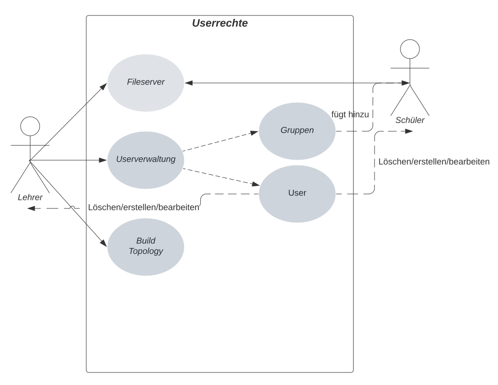
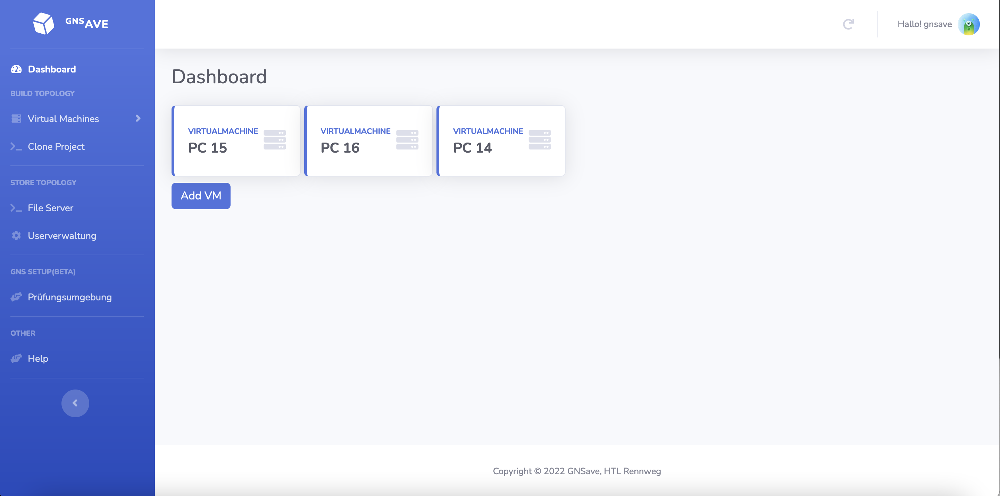
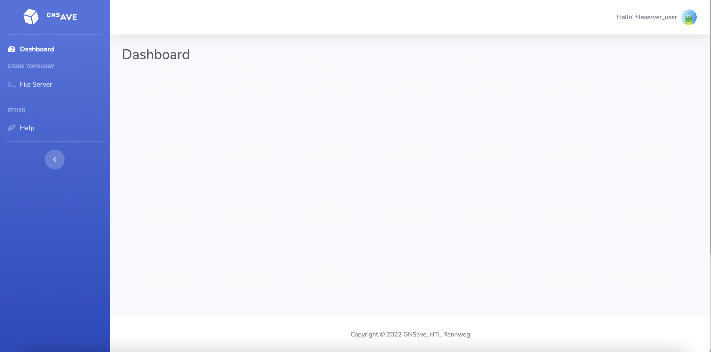
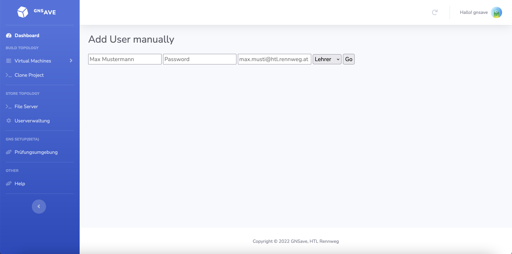
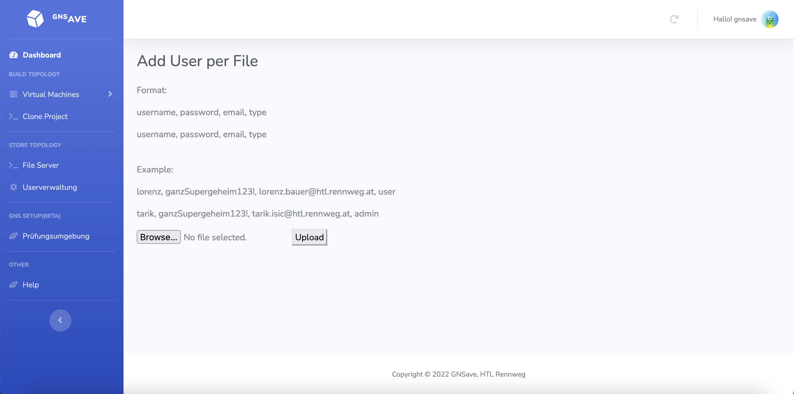
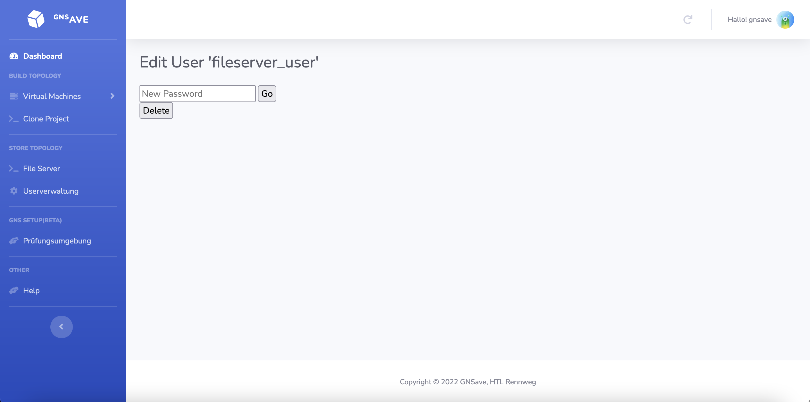
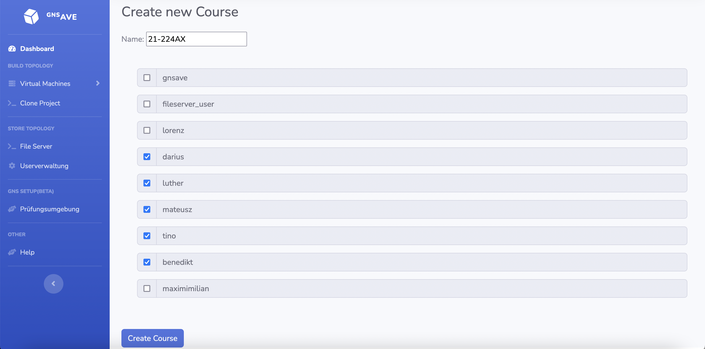

Userverwaltung
=====

.. _overview:

Überblick
------------

Die Userverwaltung basiert auf der schon in Django vorhandenen Userverwaltung. Sie verwaltet Benutzerkonten, Gruppen, Berechtigungen und Cookie-basierte Benutzersitzungen.

Usertypen
------------

In GNSave gibt es zwei Usertypen: Schüler und Lehrer. Die Lehreraccounts basieren auf dem Django Superuser und die Schüleraccounts auf den Django Usern.

Je nachdem welcher Typ der User ist hat werden ihm andere Funktionen freigeschaltet.

Jeder User hat einen Namen, ein Passwort, ein E-Mail und TYP.

Die folgenden Rechte sehen wie folgt aus:

  

Lehrer
^^^^^^^^^^^^

Lehrer haben grundsätzlich Zugriff auf alle Funktionen von GNSave. Das einzige worauf sie keinen Zugriff haben sind die privaten Dateien der Schüler.

Schüler
^^^^^^^^^^^^

Schüler haben nur Zugriff auf ihre privaten und ihre Kursdateien.  

  
User erstellen
----------------

Lehrer haben die Möglichkeit Schüler und andere Lehreraccounts zu erstellen.

Sie haben zwei Optionen wie sie das machen können.

Manuell
^^^^^^^^^^^^

Man kann schnell einzelne User per Textfeldeingabe erstellen.

Mit einer File
^^^^^^^^^^^^

Wenn man eine große Anzahl von Usern erstellen will wird es schnell ziemlich Zeitintensiv jeden einzelnen manuell hinzuzufügen.

Als Lösung bieten wir die Funktion einen Schüler per File hinzuzufügen.

**Wichtig ist, dass die File mit .txt endet.**
   

  
Die File könnte zum Beispiel so aussehen:

.. code-block:: text

    lorenz, ganzSupergeheim123!, lorenz.bauer@htl.rennweg.at, user
    darius, ganzSupergeheim123!, darius@htl.rennweg.at, user
    luther, ganzSupergeheim123!, luther@htl.rennweg.at, user
    mateusz, ganzSupergeheim123!, mateusz@htl.rennweg.at, user
    tino, ganzSupergeheim123!, tino@htl.rennweg.at, user
    august, ganzSupergeheim123!, hor@htl.rennweg.at, admin

   
User bearbeiten
----------------

Ein Lehrer kann andere Accounts(**AUCH LEHRER**) bearbeiten und entfernen.

  
Gruppe erstellen
----------------

Ein Lehrer kann Gruppen erstellen und User zu ihr hinzufügen.

Verwendete Funktionen
----------------

namespaces/fileserver/views.py

**add_user**

.. code-block:: python

   def add_user(username, password, email, superuser=False):
       user = get_user_model().objects.create_user(
       username=username,
       email=email,
       password=password
   )
   if superuser:
       user.is_superuser = True
       user.is_staff = True
   user.save()
   os.mkdir(f"./files/users/{username}")
    
**change_password**

.. code-block:: python

   def change_password(username, password):
       user = get_user_model().objects.get(username=username)
       user.set_password(password)
       user.save()
 
**delete_user**

.. code-block:: python

   def delete_user(username):
       get_user_model().objects.get(username=username).delete()
    
       courses = os.listdir("./files/courses/")
       for kurs in courses:
           if os.path.exists(f"./files/courses/{kurs}/{username}"):
               shutil.rmtree(f"./files/courses/{kurs}/{username}")

       shutil.rmtree(f"./files/users/{username}")
    
**add_group**

.. code-block:: python

   def add_group(name):
       Group.objects.get_or_create(name=name)
       os.mkdir(f"./files/courses/{name}")
    
**add_user_to_group**

.. code-block:: python

   def add_user_to_group(username, groupname):
       my_group = Group.objects.get(name=groupname)
       myuser = User.objects.get(username=username)
       my_group.user_set.add(myuser)
       os.mkdir(f"./files/courses/{groupname}/{username}")
    
Überblick der Features
----------------

Die Userverwaltung ermöglicht den Lehrern bequem auf der Weboberfläche User und Gruppen zu verwalten. Die Userverwaltung ist auch der Grundstein des Fileservers. Dadurch, dass die Schüler durch die Django Accounts segregiert werden können wir beiden Typen verschiedene Features freischalten und verschiedenen Usern erlauben, Zugriff nur auf die "richtigen" Dateien zu haben.
